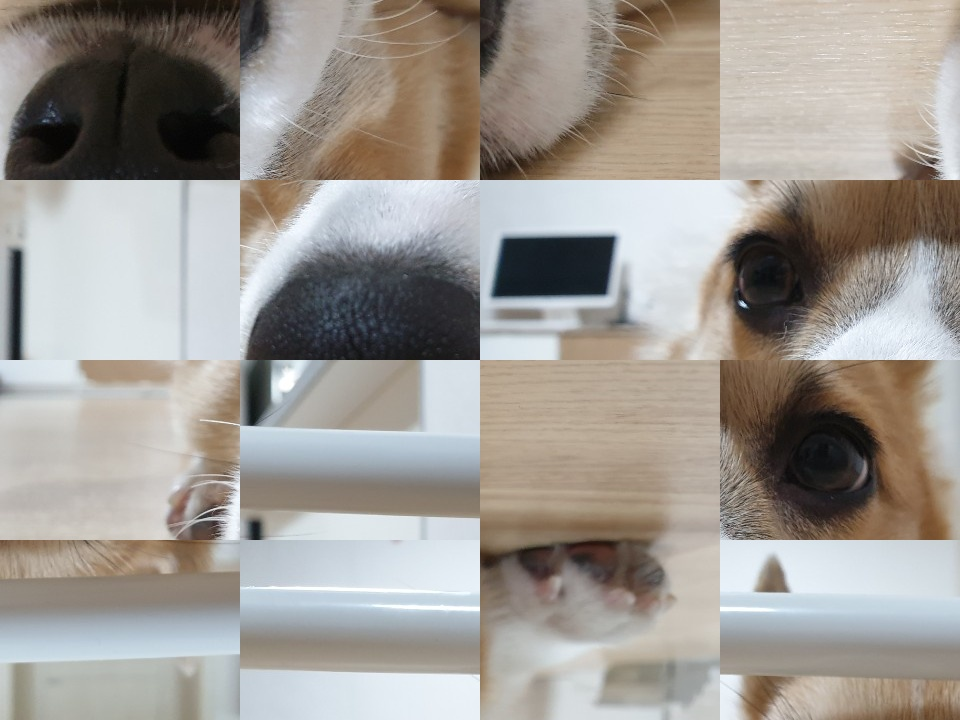

# Image Puzzler and Image Unpuzzler
This program is able to puzzle images with random piece flips and rearrange (unpuzzle) them.

## Requirement
* cv2 4.0.0
* Python 3.6.4
* numpy 1.16.1

## Getting started

### puzzling
```bash
[usage]: python3 puzzle.py file_name pieces_in_vertical pieces_in_horizontal
python3 puzzle.py sample.jpeg 4 3
```
Execute puzzling program with above usage. Result image is generated as puzzled_image.jpg
In the case of the example, sample.jpeg will be puzzled into 4 pieces vertically and 3 pieces horizontally.

### unpuzzling
```bash
[usage]: python3 unpuzzle.py pieces_in_vertical pieces_in_horizontal
python3 unpuzzle.py 4 3
```
Execute unpuzzling program with above usage. It will attempt to rearrange puzzled_image.jpg created from the puzzling program.
In the case of the example, puzzled_image.jpg will be unpuzzled given 4 pieces vertically and 3 pieces horizontally.

## Running test
### puzzling
```bash
python3 puzzle.py sample2.png 4 4
```


### unpuzzling
```bash
python3 unpuzzle.py 4 4
```


